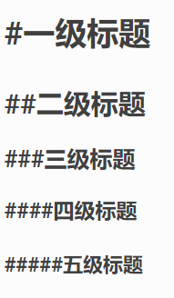

# Markdown 基础功能

Markdown 是一种可以使用普通文本编辑器编写的标记语言，通过简单的标记语法，它可以使普通文本内容具有一定的格式。

## 0. 目录

## 1. 标题

### 1.1 使用 `#` 标记标题

使用 `#` 标记标题时， `#` 必须位于行首，例如：

<div align=center></div>

### 1.2 使用`=`标记标题

在标题的下一行使用 `===` 或 `---` 表示

## 2. 段落和字体

### 2.1 分割线

使用三个或以上的 `-` 和 `*` 表示，并且该行只有符号，注意不要和二级标题混淆，可以通过在行首或者中间加空格避免被识别为二级标题。

- --

```
 - --
 - - -
 ***
 * * *
```

### 2.2 斜体和粗体

Markdown可以使用以下几种字体：

 + 用1个 `*` 或 `_` 表示斜体 
 + 用2个 `*` 或 `_` 表示粗体
 + 用3个 `*` 或 `_` 表示加粗斜体


如：

\**斜体*\* 或 \__斜体_\_

\*\***粗体**\*\* 和 \_\___粗体__\_\_

\*\*\****加粗斜体***\*\*\* 和 \_\_\____加粗斜体___\_\_\_

### 2.3 删除线和下划线

**删除线语法格式：**

```
~~删除线~~
<del>删除线</del>
```

**展示效果：**

<del>删除线</del>

**下划线语法格式：**

```
<u>下划线</u>
```

**展示效果：**

<u>下划线</u>


## 3. 超链接

### 3.1 行内式

在 `[]` 中写明链接文字，在 `()` 中写明链接地址：

```
我的[笔记本](http://www.123456.com)

我的[笔记本](http://www.123456.com 笔记本)

```

**展示效果：**

我的[笔记本](http://www.123456.com)

### 3.2 参考式

类似于学术论文的引用，参考式链接分为两部分，文中的写法 [链接文字][链接标记]，在文本的任意位置添加[链接标记]:链接地址 "链接标题"，链接地址与链接标题前有一个空格。

```
[地址1][1]、[地址2][2]、[地址3][3]

[1]:https://www.1.com "1"
[2]:https://www.2.com "2"
[3]:https://www.3.com "3"
```

**展示效果：**

[地址1][1]、[地址2][2]、[地址3][3]

[1]:https://www.1.com "1"
[2]:https://www.2.com "2"
[3]:https://www.3.com "3"

### 3.3 自动链接

只要用<>包起来，Markdown会自动将其转换成链接：

```
<https:www.example.com>

<https:www.123.com>
```

**展示效果：**

<https:www.example.com>

<https:www.123.com>


### 3.4 锚点（内部超链接）

在你准备跳转到的指定标题后插入锚点{#标记}，然后在文档的其它地方写上连接到锚点的链接。

```
## 0. 目录{#index}
跳转到[目录](#index)
```

## 4. 列表

### 4.1 无序列表

无序列表使用 `*`, `+`, `-` 表示：

```
* 1
* 2
* 3

+ 1
+ 2
+ 3

- 1
- 2
- 3
```

**展示效果：**

* 1
* 2
* 3

+ 1
+ 2
+ 3

- 1
- 2
- 3

### 4.2 有序列表

有序列表直接在文字有加上1. 2. 3. 来表示，符号和文字之间加上一个空格字符，如：

```
1. 第一项
2. 第二项
3. 第三项
```

**展示效果：**

1. 第一项
2. 第二项
3. 第三项

### 4.3 列表嵌套

列表嵌套需要在每级子列表的选项前加4个空格（Tab）：

```
1. 第一项：
    - 1.1
    - 1.2
        + 1.2.1
        + 1.2.2
2. 第二项：
    + 2.1
    + 2.2
```

**展示效果：**

1. 第一项：
    - 1.1
    - 1.2
        + 1.2.1
        + 1.2.2

2. 第二项：
    + 2.1
    + 2.2

## 区块

Markdown区块引用是在段落开头使用>符号，然后后面紧跟一个空格符号：

```
> 区块引用

> Markdown

> 1234567
```

**展示效果：**

> 区块引用

> Markdown

> 1234567

另外区块是可以嵌套的，一个>符号是最外层，两个符号是第一层嵌套，以此类推：

```
> 最外层

>> 第一层嵌套

>>> 第二层嵌套
```

**展示效果：**

> 最外层

>> 第一层嵌套

>>> 第二层嵌套

### 5.1 区块中使用列表

```
> 区块中使用列表
> 1. 第一项
> 2. 第二项
> + 第一项
> + 第二项
> + 第三项
```

**展示效果：**

> 区块中使用列表
> 1. 第一项
> 2. 第二项
> + 第一项
> + 第二项
> + 第三项

### 5.2 列表中使用区块

如果要在列表项目内放进区块，那么就需要在>前添加四个空格（Tab）和缩进。

```
* 第一项
	> 区块
	> Markdown
* 第二项
	> 区块
	> Markdown
```

**展示效果：**

* 第一项
	> 区块
	> Markdown
* 第二项
	> 区块
	> Markdown

## 6. 代码框

如果是段落上的一个函数或片段的代码可以用两个 ` 把它包起来。

```
`print()`函数
```

**展示效果：**

`print()`函数

代码区块使用4个空格（Tab）。

```
	print("Markdown")
	def test():
		print("Markdown test!")
```

**展示效果：**

	print("Markdown")
	def test():
		print("Markdown test!")

也可以使用 ``` 将代码段包裹住

## 7. 图片

Markdown图片语法格式为：

```


如：

```

**展示效果：**


图片地址也可以使用外部链接。

<u>如果需要指定图片大小，可以使用如下标签：</u>

```

```

**展示效果：**


## 8. 表格

Markdown制作表格使用 `|` 来分隔不同的单元格，使用-来分隔表头和其他行。

```
|表头1|表头2|
|----|----|
|单元格5|单元格6|
|单元格7|单元格8|
```

**展示效果：**

|表头1|表头2|
|----|----|
|单元格5|单元格6|
|单元格7|单元格8|

### 8.1 对齐方式

+ -: 设置右对齐
+ :- 设置左对齐
+ -:- 设置居中对齐

```
|左对齐|居中对齐|右对齐|
|:----|:-----:|-----:|
|单元格1|单元格2|单元格3|
|单元格4|单元格5|单元格6|
```

**展示效果：**

| 左对齐    |  居中对齐  |    右对齐 |
|:-------|:------:|-------:|
| 单元格1   |  单元格2  |   单元格3 |
| 单元格4   |  单元格5  |   单元格6 |
